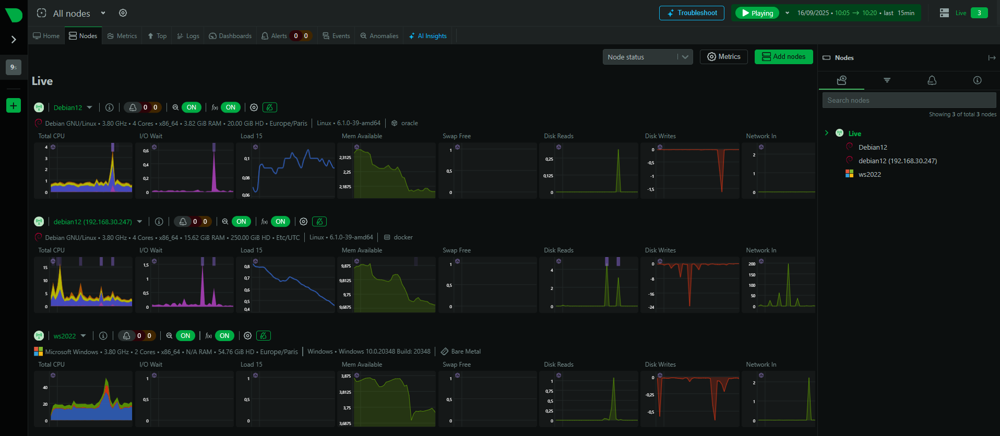
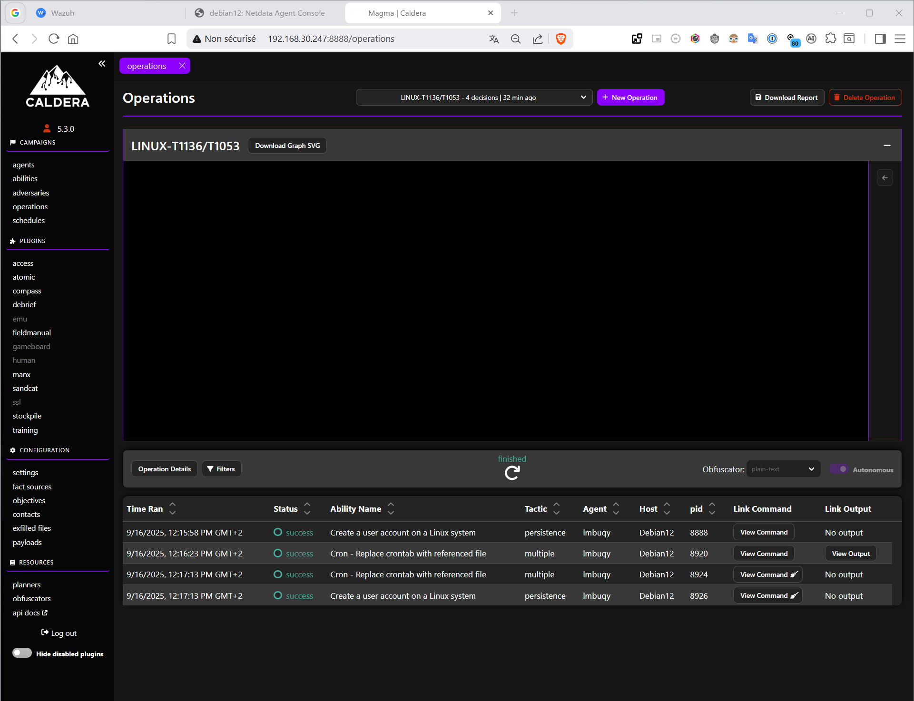

Afin d’assurer la pertinence et la reproductibilité du projet, nous avons choisi une approche conteneurisée via **Docker Compose**, offrant un déploiement rapide et cohérent sur n’importe quel environnement compatible.
Le lab intègre plusieurs composants essentiels :

- des cibles hétérogènes (Linux, Windows),
- une stack **Wazuh** pour l’EDR/XDR,
- un outil d’**observabilité système** (**Netdata**),
- et un framework de simulation d’attaques automatisées (**Caldera**).

Ce rapport présente notre démarche, les différentes étapes de mise en place du lab, les scénarios d’attaques testés, les résultats observés ainsi que les recommandations de durcissement. Un **schéma d’architecture** et les **scripts associés** complètent la documentation pour assurer la clarté et la reproductibilité du projet.

---


## 2. Démarche et méthodologie


### 2.1 Choix des outils

Le choix des solutions a été guidé par trois critères principaux : **pertinence pédagogique**, **reproductibilité technique** et **valeur ajoutée pour le client**.

- **Docker &amp; Docker Compose** :

  - Conteneurisation de l’ensemble du lab pour un déploiement rapide et cohérent.
  - Isolation des services, limitant les interférences entre les composants.
- **Wazuh (EDR/XDR)**  :

  - Détection, collecte et corrélation des événements de sécurité.
  - Interface web via le dashboard pour l’analyse centralisée.
- **Netdata (observabilité)**  :

  - Supervision en temps réel des ressources système (CPU, RAM, I/O, réseau).
  - Complément indispensable pour évaluer l’impact des attaques simulées.
- **Caldera (framework Purple Team)**  :

  - Automatisation des attaques grâce à des agents.
  - Possibilité de reproduire des tactiques et techniques MITRE ATT&CK.
- **Machines cibles** :

  - **Debian 12** et **Ubuntu** pour tester des configurations Linux.
  - **Windows Server 2022** pour simuler des attaques et collecter des Event Logs.


### 2.2 Environnement technique

Le projet a été déployé sur une machine hôte équipée de **Debian 12**.

- **Spécifications minimales** :

  - 4 vCPU
  - 8 Go RAM
  - 40 Go de stockage
- **Réseau** :

  - Les conteneurs communiquent via un réseau Docker interne.
  - Accès externe restreint aux dashboards (Wazuh, Netdata, Caldera) pour observation.

Cette configuration garantit à la fois **simplicité de mise en place**, **portabilité du lab** et **réalisme suffisant** pour simuler des scénarios d’attaques pertinents.


### 2.3 Méthodologie de travail

La démarche suivie se décompose en quatre grandes étapes :

1. **Préparation de l’environnement** : installation de Docker et mise en place du script `deploy_lab.sh`.
2. **Déploiement du lab** : lancement automatisé des conteneurs et vérification des services (Wazuh, Netdata, Caldera, cibles Linux/Windows).
3. **Exécution des scénarios d’attaques** : utilisation de Caldera pour simuler des techniques offensives.
4. **Collecte et analyse** : exploitation des logs et métriques remontés dans Wazuh et Netdata, mise en évidence des vulnérabilités et formulation de recommandations de durcissement.

Cette méthodologie garantit un **fil directeur clair**, du déploiement à l’analyse, et permet de réutiliser facilement le lab pour d’autres projets ou démonstrations.

---


## 3.Mise en place du Lab All-in-One


### 3.1 Description générale

Le lab repose sur une architecture entièrement conteneurisée via **Docker Compose**.
Cette approche assure un déploiement rapide, reproductible et isolé, adapté à des démonstrations Purple Team.
Le lab intègre des cibles hétérogènes (Linux, Windows), une stack EDR/XDR (Wazuh), un outil d’observabilité (Netdata) et un framework d’attaque automatisée (Caldera).


### 3.2 Conteneurs inclus

| Conteneur | Description                                                                         |
| ----------- | ------------------------------------------------------------------------------------- |
| **debian12**          | Serveur Debian 12 isolé pour tests de configuration et vulnérabilités classiques |
| **ubuntu**          | Serveur Ubuntu pour diversité des cibles                                           |
| **windows**          | Windows Server 2022 pour tests d’attaques et collecte des Event Logs               |
| **wazuh.manager / wazuh.indexer / wazuh.dashboard**          | Stack EDR/XDR pour collecte, corrélation et visualisation des logs                 |
| **netdata**          | Observabilité système temps réel (CPU, I/O, réseau, etc.)                       |
| **caldera**          | Framework Purple Team pour orchestrer des attaques automatisées                    |


### 3.3 Déploiement

#### Pré-requis

- Hôte : **Debian 12** (ou autre distribution compatible Docker)
- Accès administrateur (`root` ou `sudo`)
- Connexion Internet pour récupérer les images Docker et dépendances


#### 3.3.1 Clonage du dépôt Git

Récupérer le dépôt contenant la composition Docker et le script d’installation :

```bash
# depuis l'hôte
git clone https://github.com/RORODABADO/CISSP-Labs-Docker-Compose.git
cd CISSP-Labs-Docker-Compose
ls -la
# => README.md  deploy_lab.sh  docker-compose.yml  diagram.png  ...
```


#### 3.3.2 Lancement automatisé

Le script `deploy_lab.sh` automatise l’installation de Docker, le téléchargement des images et le démarrage des services.

```bash
# rendre exécutable (si besoin) et exécuter
chmod +x deploy_lab.sh
sudo ./deploy_lab.sh
```

Le script effectue, typiquement, les opérations suivantes :

- mise à jour du système et installation des paquets requis (curl, git, etc.) ;
- installation de Docker et Docker Compose (si absent) ;
- pull des images Docker nécessaires (wazuh, netdata, caldera, images cibles) ;
- `docker compose up -d` pour lancer la pile.


#### 3.3.3 Vérifications post-déploiement

Vérifier les conteneurs en fonctionnement :

```bash
docker ps --format "table {{.Names}}\t{{.Image}}\t{{.Status}}\t{{.Ports}}"
```

Exemple de sortie attendue :

```bash
NAMES                           IMAGE                                   STATUS
netdata                         netdata/netdata                         Up (healthy)
wazuh-dashboard                 wazuh/wazuh-dashboard:4.12.0            Up
wazuh-manager                   wazuh/wazuh-manager:4.12.0              Up
caldera                         mitre/caldera:...                       Up
debian12                        custom/debian12:latest                  Up
windows                         custom/windows2022:latest               Up
```

Vérifier les logs si un service ne démarre pas :

```bash
docker logs -f wazuh-manager
docker compose logs caldera
```


#### 3.3.4 Accès aux interfaces

- **Wazuh Dashboard** : `https://<host-ip>:5601` (ou port exposé défini dans le `docker-compose.yml`)
- **Netdata** : `http://<host-ip>:19999`
- **Caldera** : `http://<host-ip>:<port-caldera>` (consulter le `docker-compose.yml` pour le port)

*Note* : sécuriser l’accès aux dashboards (firewall, IP allowlist, ou authentification) si le lab est exposé hors réseau de test.


### 3.4 Bonnes pratiques de déploiement

- Déployer sur un hôte isolé ou VM dédiée pour éviter tout impact sur un réseau de production.
- Utiliser des volumes Docker pour persister les données de Wazuh/Elasticsearch et faciliter la sauvegarde.
- Documenter les mots de passe et tokens générés par le déploiement (fichier `SECRETS.md` ou équivalent, stocké en dehors du dépôt public).
- Mettre en place un fichier `.env` pour centraliser les variables (ports, chemins, credentials) et faciliter la personnalisation.


### 3.5 Résumé

Le dépôt `RORODABADO/CISSP-Labs-Docker-Compose` et le script `deploy_lab.sh` permettent de cloner, installer et démarrer rapidement un lab Purple Team complet. Le lab est autonome, reproductible et prêt pour l’exécution de scénarios d’attaque et l’analyse via Wazuh/Netdata/Caldera.

---


## 4. Préparation pour pentest

Avant d’exécuter les scénarios d’attaque, nous avons procédé à l’installation et à la configuration des agents nécessaires pour la supervision, la collecte de logs et l’orchestration des attaques. Cette section décrit les opérations réalisées pour **Netdata**, **Wazuh** et **Caldera (Sandcat)** , ainsi que les vérifications effectuées.


### Installation et configuration des agents Netdata

Pour superviser notre infrastructure, nous utilisons l'outil **Netdata**.

Netdata est accessible depuis l’interface réseau du lab à l’adresse : `http://192.168.30.252:19999`


Afin de superviser nos machines Linux et Windows, il est nécessaire d'installer les agents Netdata sur chacune des cibles.


#### Pour nos machines Linux

Génération de la ligne d'installation depuis l’interface Netdata :


Lancer les commandes indiquées et s’assurer que l’agent remonte les métriques sur le serveur Netdata :


#### Pour nos machines Windows

Génération de la ligne d'installation depuis l’interface Netdata :


Lancer les commandes indiquées et s’assurer que l’agent remonte les métriques sur le serveur Netdata :


#### Résultat

Nous pouvons maintenant monitorer toutes nos cibles depuis une seule interface :


### Installation et configuration des agents Wazuh

Pour collecter les logs, détecter les événements et centraliser les alertes, nous utilisons **Wazuh**.

Wazuh Dashboard est accessible à : `https://192.168.30.252`
 *(identifiants par défaut durant les tests :*  *`admin / SecretPassword`*  *— changer en production.)*


Interface principale après authentification :


Le premier objectif est d’installer des agents Wazuh sur nos machines Linux et Windows afin de centraliser les événements.


#### Pour nos machines Linux

Depuis le Dashboard Wazuh (ou via package), générer la ligne d’installation / les instructions et exécuter sur la cible :


Puis lancer les commandes indiquées en 4 et 5 pour démarrer l'agent.


#### Pour nos machines Windows

Génération de la ligne d’installation depuis le Dashboard Wazuh (Windows) :


Puis lancer les commandes indiquées en 4 et 5 pour démarrer l'agent :


#### Résultat

Les agents apparaissent correctement dans le centre d’administration Wazuh :


### Installation et configuration des agents Caldera (Sandcat)

Pour orchestrer et automatiser les attaques Purple Team, nous utilisons **Caldera**. Caldera permet de générer et déployer les agents **Sandcat** sur les cibles.

La première étape consiste à récupérer le mot de passe de l’utilisateur `red` (compte d’accès Caldera) depuis la configuration locale (`conf/local.yml`) puis à se connecter à l’interface Caldera :

1. Connexion en tant qu’utilisateur `red` — mot de passe dans `conf/local.yml`.
2. Accès à la console Caldera avec le compte `red`.


#### Pour nos machines Windows

Dans l’UI Caldera → Agents → Deploy agent : Caldera génère la commande adaptée à exécuter sur la cible. 

- Exécuter la commande PowerShell fournie par Caldera sur la VM Windows.

> Remarque : Windows Defender ou règles de sécurité peuvent empêcher le bon fonctionnement de l’agent. Dans le lab, nous avons temporairement désactivé/assoupli les règles pour permettre l’expérimentation.


Après déploiement, l’agent devient actif :


#### Pour nos machines Linux

Dans l’UI Caldera → Agents → Deploy agent : Caldera génère la commande adaptée à exécuter sur la cible. 

- Exécuter la commande fournie par Caldera sur la VM Debian/Ubuntu.


L’agent devient ensuite actif sur la VM Linux :


#### Résultat

Les agents déployés apparaissent tous dans l’interface Caldera :


### Vérifications finales et monitoring en continu

À ce stade, l’ensemble du lab est prêt pour les tests de pentest :

- **Netdata** est opérationnel sur toutes les cibles :

  - les métriques CPU, RAM, réseau et I/O remontent bien,
  - l’interface globale (`http://192.168.30.252:19999`) permet de visualiser l’activité consolidée,
  - des pics d’utilisation sont visibles lors de l’installation des agents et des premières attaques.

    
- **Les agents Caldera** sont présents et beaconent → prêts à exécuter des abilities/techniques offensives.

  
- **Wazuh** reçoit des événements et détecte déjà certains mouvements suspects (connexions, modifications de fichiers, exécutions inhabituelles).

---


## 5. Pentest et observations sur Wazuh & Netdata (avec CALDERA)


### 5.1 Pré-requis spécifiques à cette campagne

#### 5.1.1 Accès & agents

- Agents **Sandcat** (CALDERA) actifs sur les VMs **Debian/Ubuntu** et **Windows** (voir section 4).
- Agents **Wazuh** déployés et **connectés** au manager (voir section 4).
- **Netdata** opérationnel pour visualiser l’impact système/réseau en temps réel (voir section 4).


#### 5.1.2 Windows : installation de Sysmon + collecte Wazuh

Sysmon enrichit les journaux Windows (corrélation MITRE facilitée).

1. Installer Sysmon avec un fichier de conf (ex. `sysmonconfig.xml`) :

```powershell
# PowerShell (Admin)
.\sysmon.exe -accepteula -i .\sysmonconfig.xml
```


2. Activer la collecte Sysmon dans l’agent Wazuh (Windows) : éditer
    `C:\Program Files (x86)\ossec-agent\ossec.conf` et ajouter :


```xml
<localfile>
  <location>Microsoft-Windows-Sysmon/Operational</location>
  <log_format>eventchannel</log_format>
</localfile>
```


3. Redémarrer l’agent :


```powershell
Restart-Service -Name wazuh
```


### 5.2 Configuration des profils adversaires (CALDERA) & exécution des opérations

Cette section décrit la création des **profils adversaires** dans CALDERA, l’ajout des **techniques MITRE** par OS, puis l’**exécution d’opérations** contre nos endpoints Linux et Windows.


#### 5.2.1 Création des profils adversaires

- Accéder à l’UI CALDERA (`http://<CALDERA_HOST>:8888`, compte `red`).
- Aller dans **Adversaries** → **Create adversary**.

**Profil Linux**

- **Nom** : `Linux-Adv-Profile`
- **Description** : `Linux MITRE techniques`
- **Abilities** (Add Ability) :

  - `T1136.001` — Create Account: Local Account
  - `T1053.003` — Scheduled Task/Job: Cron
- **Save Profile**


**Profil Windows**

- **Nom** : `Windows-Adv-Profile`
- **Description** : `Windows MITRE techniques`
- **Abilities** (Add Ability) :

  - `T1197` — BITS Jobs
  - `T1040` — Network Sniffing (nécessite Wireshark/Tshark)
  - `T1021.001` — Remote Services: RDP (modification du port)
- **Save Profile**


### 5.3 Détection avec Wazuh (OOB + règles personnalisées)

Les attaques Linux sont en grande partie **détectées par les règles intégrées** (out-of-the-box) de Wazuh :

- Création/suppression de comptes (T1136.001/T1531)
- Modification de crontab (T1053.003)

Pour **renforcer** la détection sur Windows, nous ajoutons des **règles custom** ciblant nos 3 techniques :


#### 5.3.1 Règles personnalisées Wazuh (Windows)

Éditer sur le **Wazuh Manager** : `/var/ossec/etc/rules/local_rules.xml` et ajouter :

```xml
<group name="windows">
  <rule id="180001" level="15" ignore="120">
    <if_group>windows</if_group>
    <match>bitsadmin.exe /transfer /Download /priority Foreground</match>
    <description>Suspicious download and execution with BITS job on $(win.system.computer)</description>
    <mitre><id>T1197</id></mitre>
  </rule>

  <rule id="180002" level="12" ignore="120">
    <if_group>windows</if_group>
    <match type="pcre2">(?i)(tshark|wireshark)</match>
    <description>Network sniffing tool discovered on $(win.system.computer)</description>
    <mitre><id>T1040</id></mitre>
  </rule>

  <rule id="180003" level="15" ignore="120">
    <if_group>windows</if_group>
    <field name="win.eventdata.commandline" type="pcre2">
      reg add \\\"HKLM\\\\System\\\\CurrentControlSet\\\\Control\\\\Terminal Server\\\\WinStations\\\\RDP-Tcp\\\" /v PortNumber /t REG_DWORD *
    </field>
    <description>RDP port has been changed on $(win.system.computer)</description>
    <mitre><id>T1021.001</id></mitre>
  </rule>
</group>
```

Pour cela, entrer dans le conteneur :

```bash
docker exec -it single-node-wazuh.manager-1 bash
```

Sauvegarder puis éditer le fichier des règles

```bash
cp /var/ossec/etc/rules/local_rules.xml /var/ossec/etc/rules/local_rules.xml.bak.$(date +%F-%H%M)
nano /var/ossec/etc/rules/local_rules.xml
```

Redémarrer le manager puis vérifier 

```bash
4) Redémarrer le manager et vérifier
/var/ossec/bin/wazuh-control restart
tail -n 200 -f /var/ossec/logs/ossec.log
```


### 5.4 Démonstrations & Résultats

#### Lancer les opérations contre les endpoints

1. Aller dans **Operations** → **New operation**.
2. **Name** :  `LINUX-T1136/T1053` / `WIN-T1197/T1040/T1021.001` (nom explicite = corrélation plus facile).
3. **Adversary** : choisir `Linux-Adv-Profile` (pour les cibles Linux) ou `Windows-Adv-Profile` (pour Windows).
4. **Agents** : sélectionner l’agent cible (Debian/Ubuntu ou Windows).
5. **Start** pour démarrer l’attaque ; à la fin, **Stop** puis lancer le **cleanup** (si défini).


##### Démonstration Linux

1. Création de l'opération


2. Lancement et success



3. Analyse des résultats sur Wazuh :

    Les **techniques Linux** (T1136.001, T1053.003, cleanup T1531) ont été **détectées** par les règles Wazuh OOB :


##### Démonstration Windows

1. Création de l'opération


2. Lancement et success


3. Analyse des résultats sur Wazuh :

    Les **techniques Windows** (T1197, T1040, T1021.001) ont déclenché des **alertes** grâce à la combinaison **Sysmon + Wazuh** (règles OOB + custom) :


##### Dashboard : Wazuh & Netdata

Voici l'état du **Dashboard Wazuh** après nos différentes simulations :

>  On remarque que les évenement ont bien été enregistrés.


